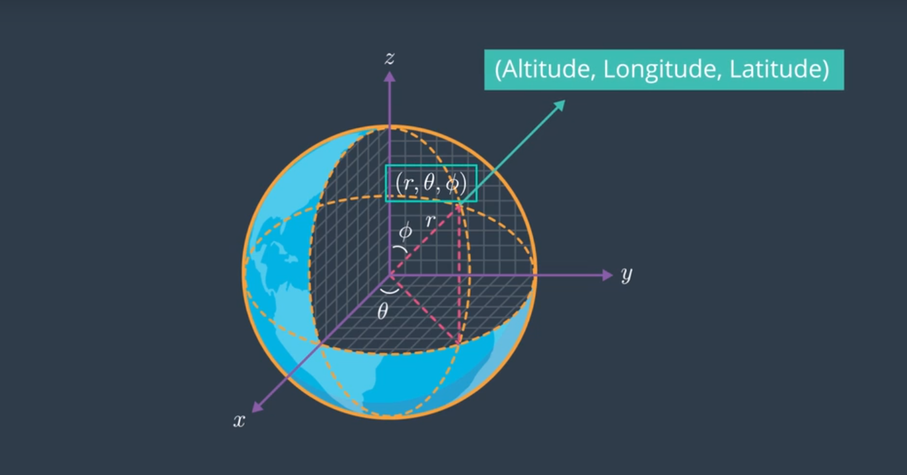
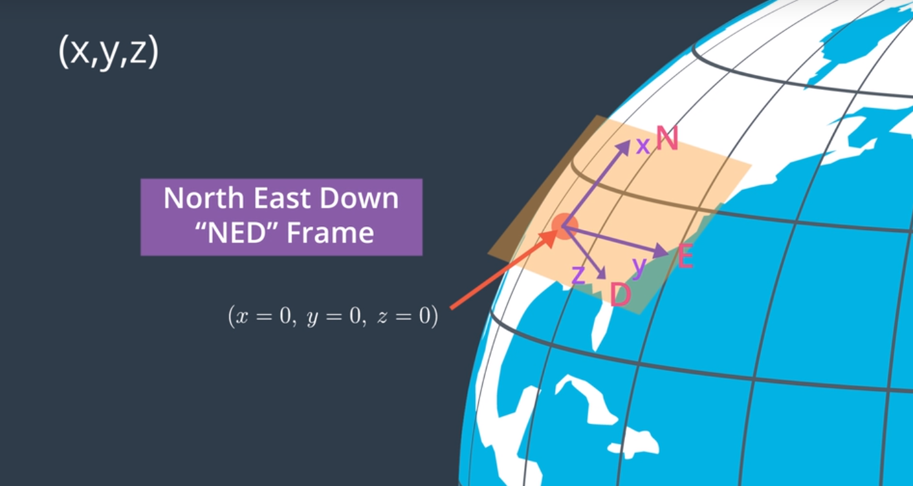

# AAE_Notebook_002_GeoNED
The notebook represents a coordinate conversion from the [Geodetic Frame](https://en.wikipedia.org/wiki/World_Geodetic_System) to a [NED](https://en.wikipedia.org/wiki/Local_tangent_plane_coordinates#Local_north,_east,_down_(NED)_coordinates) aeronautical representation of the [ECEF](https://en.wikipedia.org/wiki/ECEF) Frame.

In representing a AAV, the choice of model representation can make the planning problem easier or harder to solve. So, how are we going to represent the model?

One of the most common, and familiar, representations is via a coordinate frame using latitude and longitude. This is known as the Geodetic Frame. In the Geodetic frame, we'll specify the AAV's altitude as its position above the surface of the Earth, leaving latitude and longitude to specify its position on the Earth's surface. (Lat/Lon can be given in degrees, minutes, seconds or degrees decimal.)

Being as Geodetic Coordinates are spherical coordinates, we'll want to convert them to a linearized cartesian frame known as the ECEF (Earth-Centered, Earth-Fixed) frame.

Now that we have a linearized frame, we'll want a coordinate system that has its origin somewhere on the surface of the Earth -- Say, our home base or even take-off origin. 

From that coordinate system, we'll need to delineate our directional coordinates and altitude. (In the following picture X and Y representing our lateral distance, from the origin of the frame, with Z representing our altitude above the origin.) This is our Local ECEF Frame.

The most common representation of the Local ECEF Frame in aeronautics is to have our X and Y represent North and East. Using the right-hand rule, we're left with Z (altitude) being positive downward; thus, we are left with the 'North, East, Down' representation of our Local ECEF Frame.

